# Manufacturing Process – Forging Analysis

Design, simulation, and optimization of a **C45 steel hot-forging process**, including CAD modeling, forged-part design, billet and die dimensioning, flash design, and 2D/3D QForm process simulation.

<p align="center">
  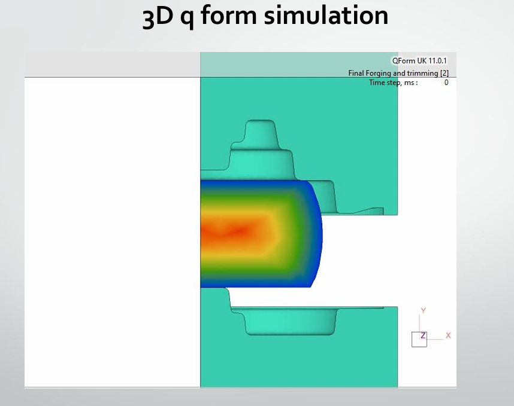
</p>

---

## Project Overview

This project was developed as part of a university **Manufacturing Processes** group project.

The objective was to design and evaluate the manufacturing process of a C45 steel mechanical component, starting from the nominal part geometry and progressing through forged-part design, billet sizing, tooling design, process simulation, and optimization.

The project includes:

- Nominal-part CAD modeling
- C45 steel material analysis
- Forged-part design
- Forging and machining allowances
- Draft-angle and fillet considerations
- Flash design
- Billet dimensioning
- Die-block dimensioning
- Upper and lower die design
- Forging assembly
- Upsetting-stage modeling
- Trimming-stage modeling
- 2D QForm simulation
- 3D QForm simulation
- Stress and strain analysis
- Workpiece-temperature analysis
- Tool-temperature analysis
- Billet-geometry optimization
- Lubrication analysis

---

## Manufacturing Workflow

```text
Nominal Part
     ↓
Material and Geometry Analysis
     ↓
Forged Part Design
     ↓
Flash Design
     ↓
Billet Dimensioning
     ↓
Die Design
     ↓
Upsetting
     ↓
2D QForm Simulation
     ↓
Process Optimization
     ↓
3D QForm Simulation
     ↓
Thermal Analysis
     ↓
Lubrication Optimization
```

---

## CAD Design

The forging process and associated tooling were modeled using **SolidWorks**.

The CAD models include:

- Billet
- Forged component
- Upper forging die
- Lower forging die
- Forging assembly
- Upsetting stage
- Subsequent forging stage
- Trimming stage

Both native **SolidWorks** files and neutral **STEP** models are included in the repository.

### CAD Files

[View CAD models](cad/)

The CAD directory contains:

```text
cad/
├── solidworks/
│   ├── Forging_Assembly.SLDASM
│   ├── Billet.SLDPRT
│   ├── Forged_Part.SLDPRT
│   ├── Upper_Die.SLDPRT
│   ├── Lower_Die.SLDPRT
│   └── additional tooling components
│
└── step/
    ├── Upsetting_Stage.STEP
    ├── Forging_Second_Stage.STEP
    └── Trimming_Stage.STEP
```

The STEP files are provided to make the geometry accessible in CAD/CAE software without requiring SolidWorks.

---

# 2D QForm Simulation

The first stage of the process analysis was performed using a **2D QForm forging simulation**.

The simulation was used to investigate:

- Material flow
- Die filling
- Flash formation
- Process defects
- Stress distribution
- Strain distribution
- Billet-dimension suitability

## Initial 2D Simulation

<p align="center">
  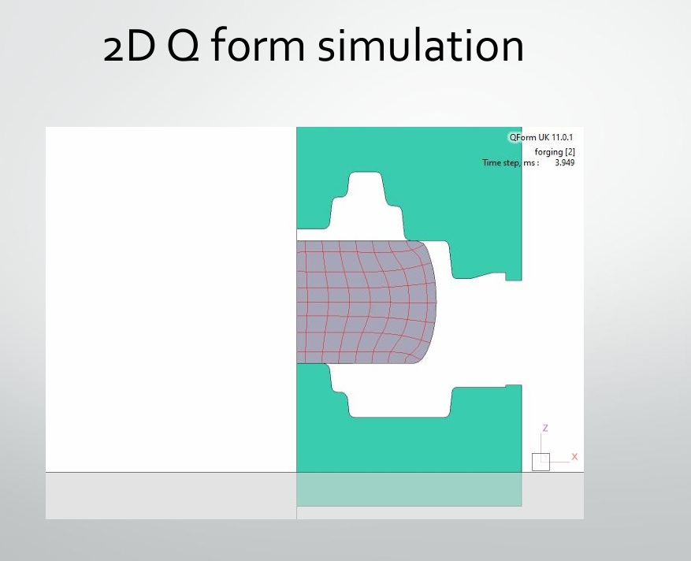
</p>

The initial simulation revealed issues related to the billet geometry and flash formation.

<p align="center">
  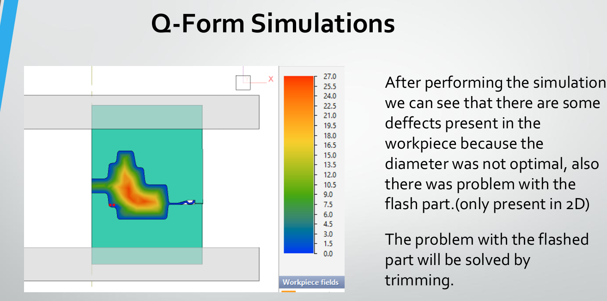
</p>

---

## Billet Optimization

Based on the initial QForm results, the billet dimensions were modified.

The billet height was reduced while its diameter was increased in order to improve the material flow and filling behavior.

<p align="center">
  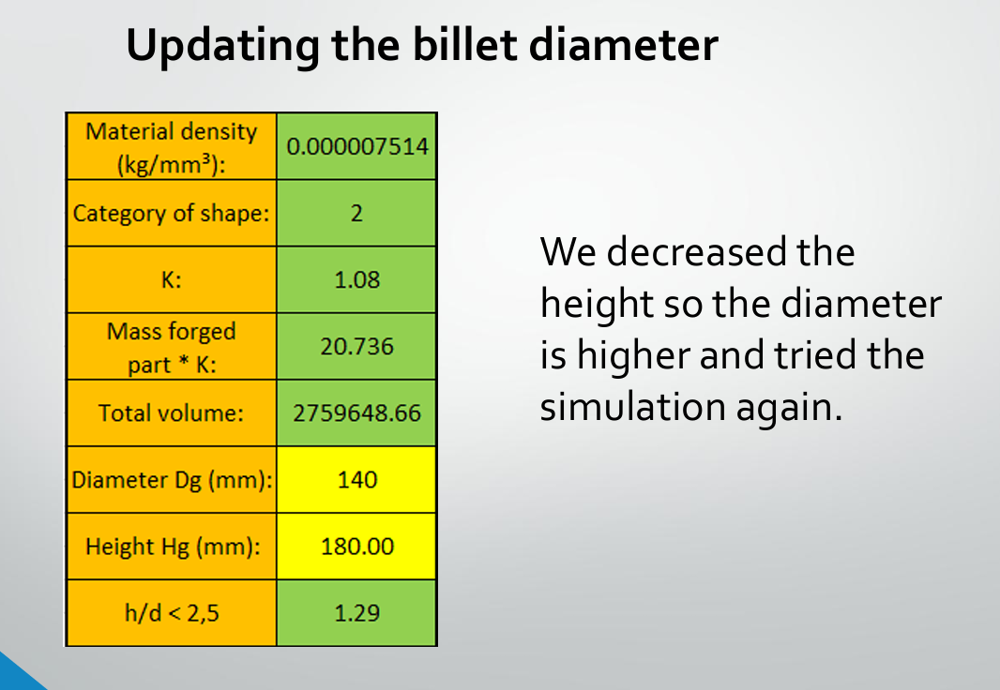
</p>

The simulation was then repeated using the updated configuration.

---

## Optimized 2D Simulation

<p align="center">
  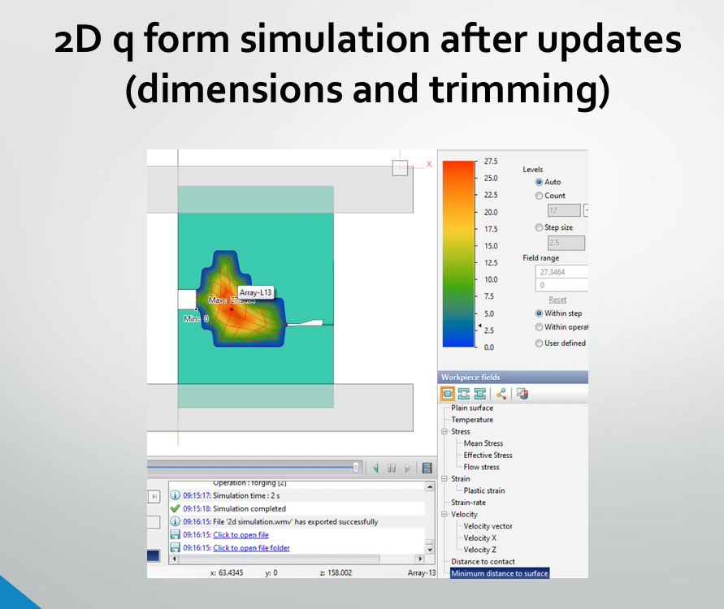
</p>

The updated simulation was used to evaluate the improved forming process after modifying the billet geometry and trimming configuration.

---

## Stress Analysis

The workpiece stress distribution was evaluated during the forming operation.

<p align="center">
  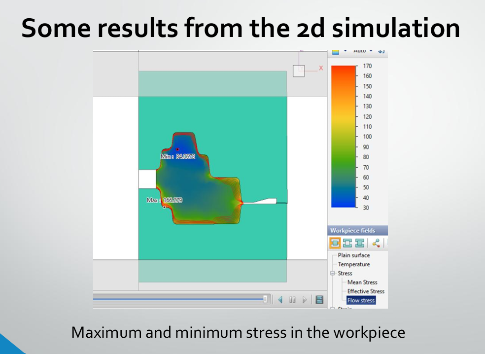
</p>

---

## Strain Analysis

The corresponding strain distribution was also evaluated.

<p align="center">
  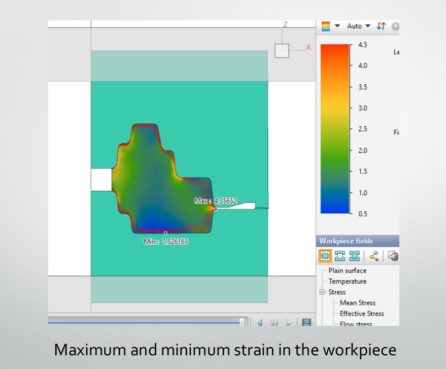
</p>

---

## Die Stress Analysis

The stresses acting on the forging dies were also investigated.

<p align="center">
  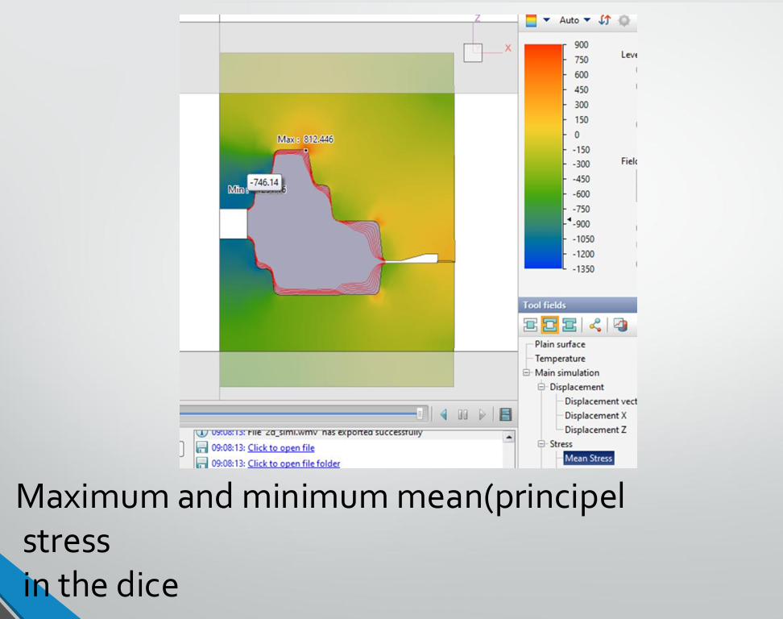
</p>

---

## 2D Simulation Video

A video of the complete 2D QForm forming simulation is included in the repository.

[▶ View 2D QForm Simulation](simulation/2D-QForm/2D_QForm_Simulation.wmv)

Additional 2D simulation results can be found here:

[View 2D QForm results](simulation/2D-QForm/)

---

# 3D QForm Simulation

A **3D QForm simulation** was subsequently performed to evaluate the complete forging process and its thermal behavior.

<p align="center">
  
</p>

The 3D analysis focused particularly on:

- Three-dimensional material flow
- Workpiece temperature
- Tool temperature
- Thermal behavior during forging
- Influence of lubricant selection

---

## Initial Workpiece Temperature

The initial thermal simulation showed that the minimum workpiece temperature decreased to approximately **678.7 °C**.

This was below the targeted forging-temperature range used in the project.

<p align="center">
  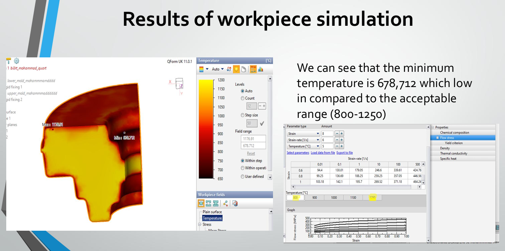
</p>

---

## Initial Tool Temperature

Tool temperatures were also evaluated before changing the process lubricant.

<p align="center">
  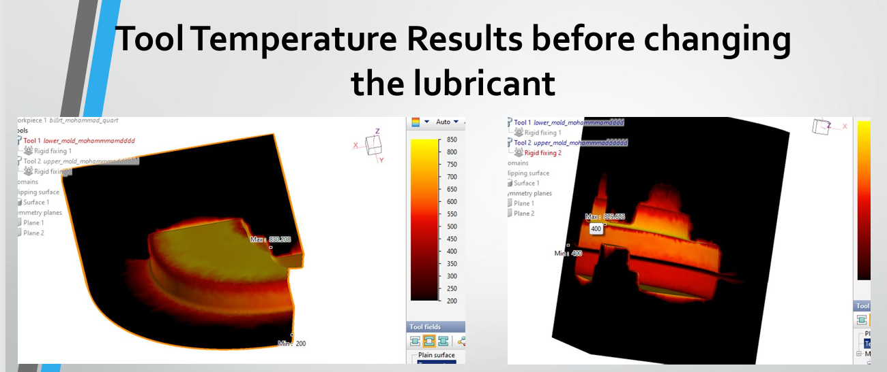
</p>

---

# Lubrication Optimization

The initial process used a **graphite + water lubricant**.

Based on the thermal simulation results, the lubricant was changed to **glass** and the process was simulated again.

The purpose of this change was to improve the thermal behavior of both the workpiece and the forging tools.

---

## Workpiece Temperature After Lubricant Change

After changing the lubricant to glass, the minimum workpiece temperature increased to approximately **800 °C**.

<p align="center">
  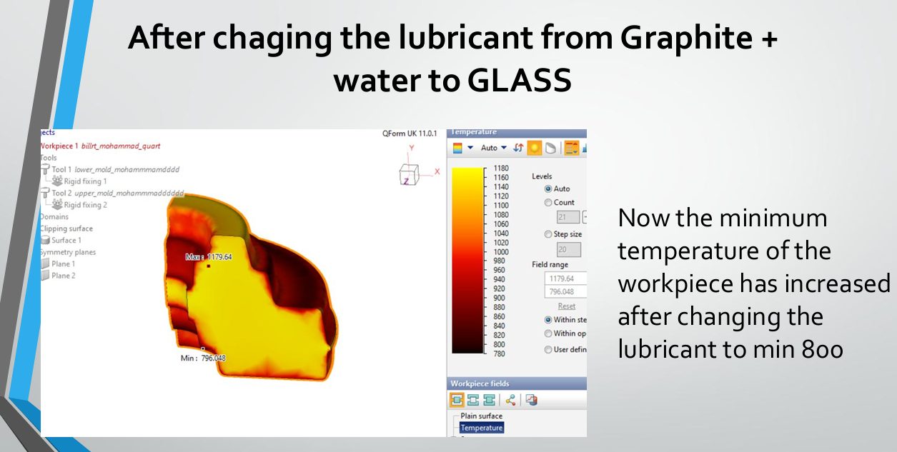
</p>

---

## Tool Temperature After Lubricant Change

The simulation also showed a reduction in tool heating after changing the lubricant.

<p align="center">
  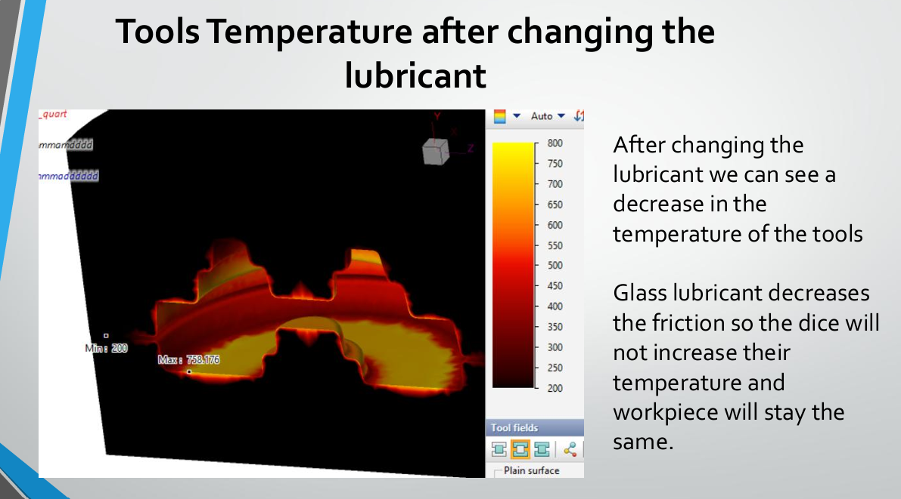
</p>

This comparison demonstrated how lubricant selection can influence the thermal behavior of the forging process.

---

## 3D Simulation Video

A video of the 3D QForm forging simulation is also included in the repository.

[▶ View 3D QForm Simulation](simulation/3D-QForm/3D_QForm_Simulation.wmv)

Additional 3D results can be found here:

[View 3D QForm results](simulation/3D-QForm/)

---

# Engineering Documentation

## Project Report

The complete project report contains the engineering calculations, CAD development, forging-process design, simulation results, and process optimization.

[📄 View Manufacturing Process – Forging Analysis Report](report/Manufacturing_Process_Forging_Analysis_Report.pdf)

---

## Technical Drawing

The repository also includes the engineering drawing of the studied component.

[📐 View C45 Component Technical Drawing](drawings/C45_Forged_Component_Technical_Drawing.pdf)

---

# Repository Structure

```text
manufacturing-process-forging-analysis/
│
├── README.md
│
├── report/
│   ├── README.md
│   └── Manufacturing_Process_Forging_Analysis_Report.pdf
│
├── drawings/
│   ├── README.md
│   └── C45_Forged_Component_Technical_Drawing.pdf
│
├── cad/
│   ├── README.md
│   ├── solidworks/
│   │   ├── Forging_Assembly.SLDASM
│   │   ├── Billet.SLDPRT
│   │   ├── Forged_Part.SLDPRT
│   │   ├── Upper_Die.SLDPRT
│   │   ├── Lower_Die.SLDPRT
│   │   └── additional tooling components
│   │
│   └── step/
│       ├── Upsetting_Stage.STEP
│       ├── Forging_Second_Stage.STEP
│       └── Trimming_Stage.STEP
│
└── simulation/
    ├── README.md
    │
    ├── 2D-QForm/
    │   ├── README.md
    │   ├── 2D_QForm_Simulation.wmv
    │   └── figures/
    │       ├── README.md
    │       ├── 01_Initial_2D_Simulation.png
    │       ├── 02_Initial_Process_Defects.png
    │       ├── 03_Billet_Dimension_Update.png
    │       ├── 04_Optimized_2D_Simulation.png
    │       ├── 05_Workpiece_Stress_Distribution.png
    │       ├── 06_Workpiece_Strain_Distribution.png
    │       └── 07_Die_Mean_Stress.png
    │
    └── 3D-QForm/
        ├── README.md
        ├── 3D_QForm_Simulation.wmv
        └── figures/
            ├── README.md
            ├── 01_3D_Forging_Simulation.png
            ├── 02_Workpiece_Temperature_Before_Optimization.png
            ├── 03_Tool_Temperature_Before_Lubricant_Change.png
            ├── 04_Workpiece_Temperature_After_Glass_Lubricant.png
            └── 05_Tool_Temperature_After_Glass_Lubricant.png
```

---

# Software and Tools

- **SolidWorks** – CAD modeling, tooling design, assemblies, and engineering drawings
- **QForm** – 2D and 3D forging-process simulation
- **Microsoft Excel** – Engineering calculations and process dimensioning
- **STEP** – Neutral CAD exchange format

---

# Engineering Topics

This project covers several areas of manufacturing and mechanical engineering:

- Manufacturing process design
- Metal forming
- Hot forging
- CAD modeling
- Tool and die design
- Billet design
- Finite-element process simulation
- Stress analysis
- Strain analysis
- Thermal analysis
- Process optimization
- Lubrication effects
- Design for manufacturing

---

# Team

This project was completed as a university **Manufacturing Processes group project**.

### Team Members

- **Mohamad Nour Edeen**
- **Mohamad Mahdi**

---

# Repository Topics

`manufacturing-engineering` `forging` `hot-forging` `metal-forming` `qform` `solidworks` `cad` `c45-steel` `process-simulation` `mechanical-engineering` `tool-design` `thermal-analysis`
